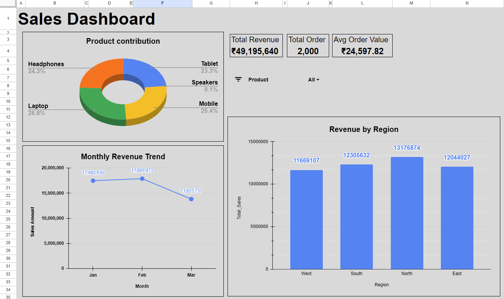

# Sales Dashboard - Google Sheets

# Project Overview:
This project focuses on building an interactive  **Sales Dashboard** using **Google Sheets** to analyze sales performance and business trends.

The **Sales Dashboard** transforms raw sales data into meaningful insights using pivot tables, KPIs, and charts, helping stakeholders make **data-driven decisions**.

-----

# Dataset
  The dataset contains raw sales data ('Raw_Data.csv') with the following columns:
  - Order_ID
  - Order_Month
  - Order_Date
  - Region
  - Product
  - Sales_Amount

-----

The raw dataset is provided as a CSV file for reproducibility and transparency.

# Tools and Skills Used:
  Google Sheets
     - Pivot Tables.
     - KPI Cards.
     - Charts (Bar Chart, Line Chart, Donut Chart).
     - Basic Excel Formulas (SUM, COUNT, AVERAGE).
     - Dashboard Design & Formatting.

-----

#  KPIs Tracked:
  - Total Revenue.
  - Total Orders.
  - Average Order Value.

-----

# Dashboard Preview:

-----

# Key Learnings:
  - Converting raw data into business-ready dashboards.
  - Designing KPI-driven dashboards.
  - Presenting insights visually for non-technical stakeholders.

# How to Use
1. Open the raw dataset (`Raw_Data.csv`).
2. Load data into Google Sheets.
3. Create pivot tables and KPI calculations.
4. Build an interactive dashboard using charts and formatting.

# Live Dashboard (Google Sheets):
This analysis is based on the live Google Sheets dashboard:-

- [View Dashboard on Google Sheets](https://docs.google.com/spreadsheets/d/1SRqU0c6Jp_vVCEq1feZO7diQygDeRx7-7PAAX8Ajer4/edit?usp=sharing)
